# Kalika ERP — Complete Working Flow Diagram

This document describes the end-to-end architecture, data flows, request lifecycles, and business processes of the Kalika Enterprises ERP system.

---

## 1. High-Level System Architecture

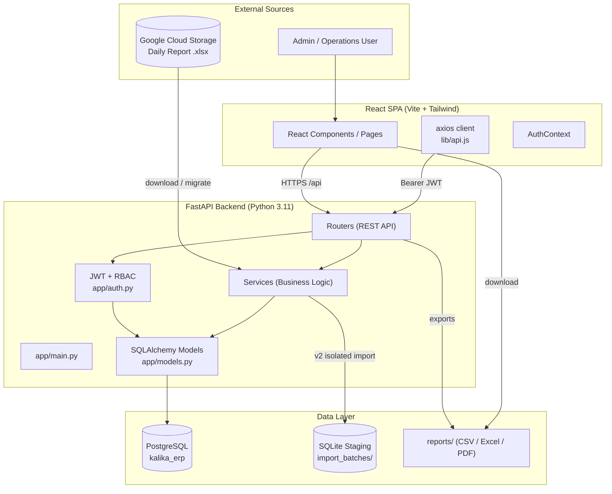

---

## 2. End-to-End Data Flow

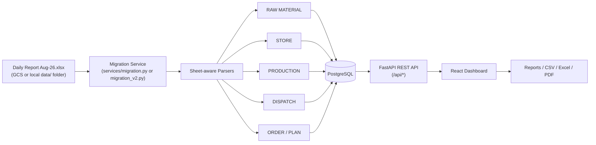

---

## 3. Backend Request Lifecycle

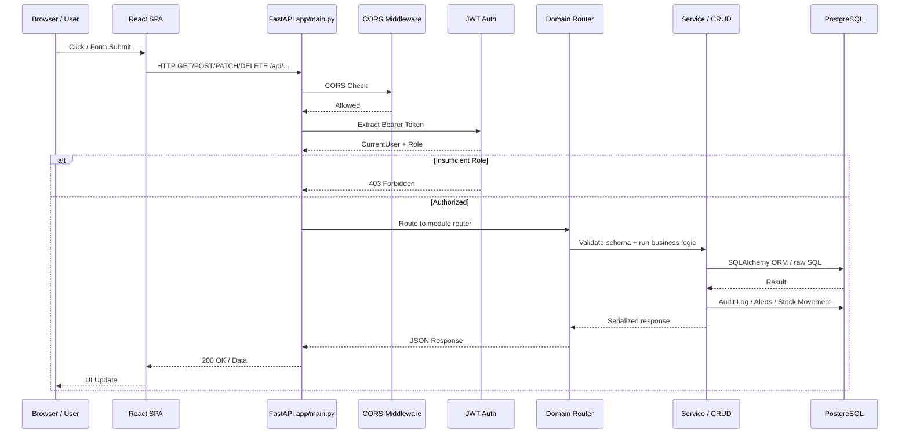

---

## 4. Authentication & Authorization Flow

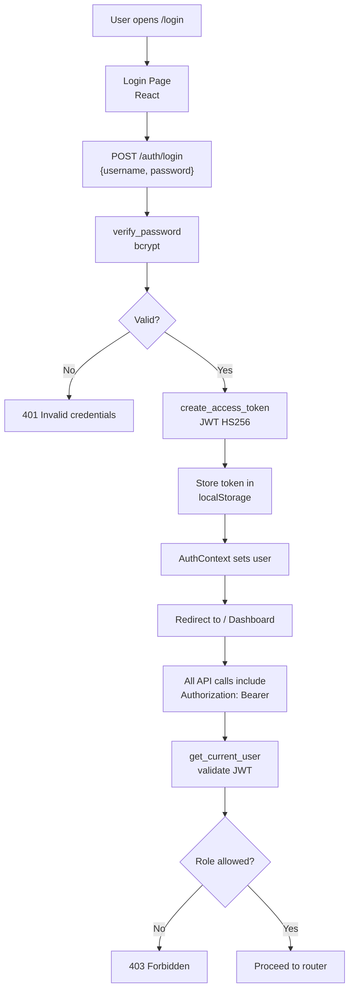

### Roles

| Role | Permissions |
|------|-------------|
| admin | Full access |
| manager | Read + write masters + transactions |
| store | Purchase receive / inventory |
| production | Production output |
| dispatch | Dispatch lines |
| viewer | Read-only |

---

## 5. Database Schema Overview

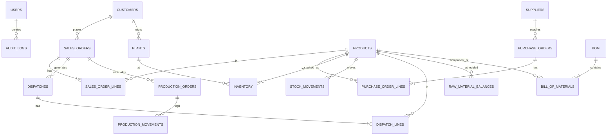

---

## 6. Data Migration Flows

### 6.1 Legacy Migration (v1) — Live PostgreSQL

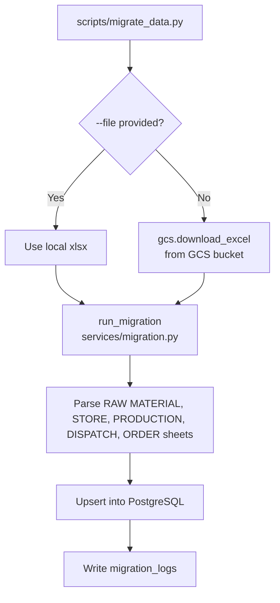

### 6.2 Isolated Migration (v2) — Staging First

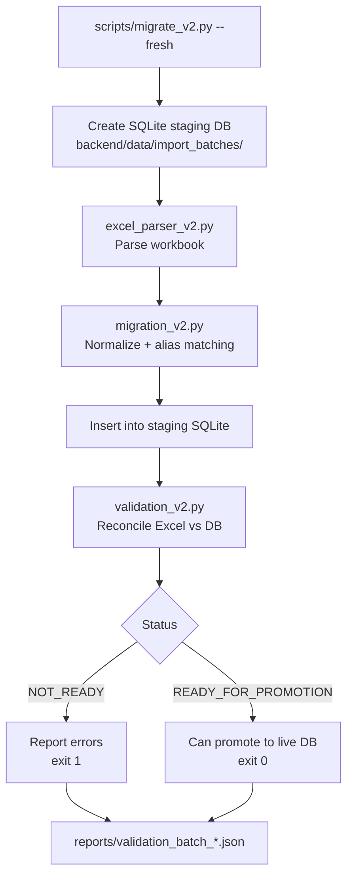

---

## 7. Purchase Order → Inventory Flow

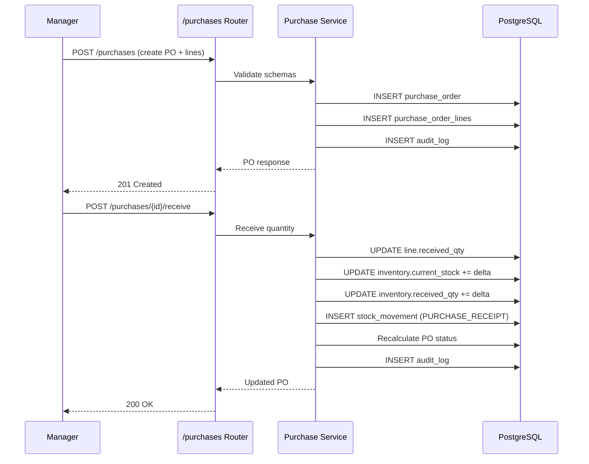

---

## 8. Sales Order Lifecycle

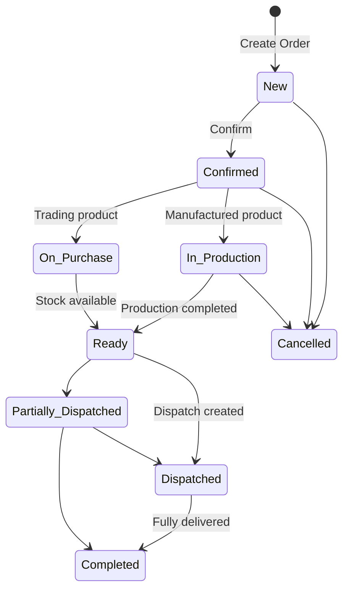

### Automatic Status Recomputation

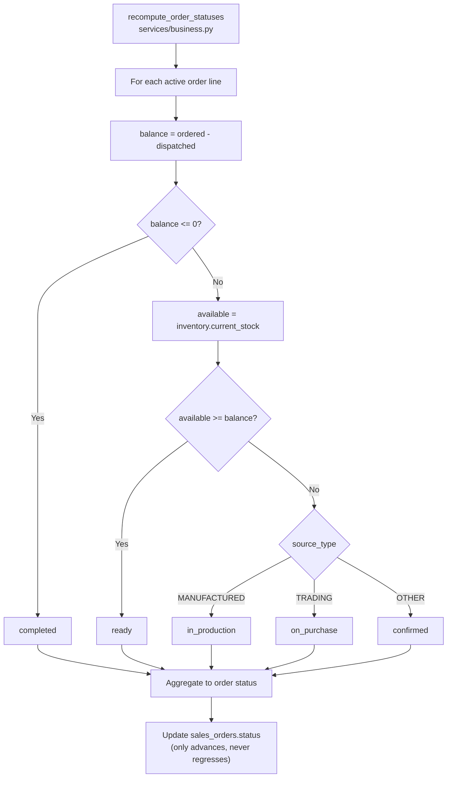

---

## 9. Production → Dispatch Flow

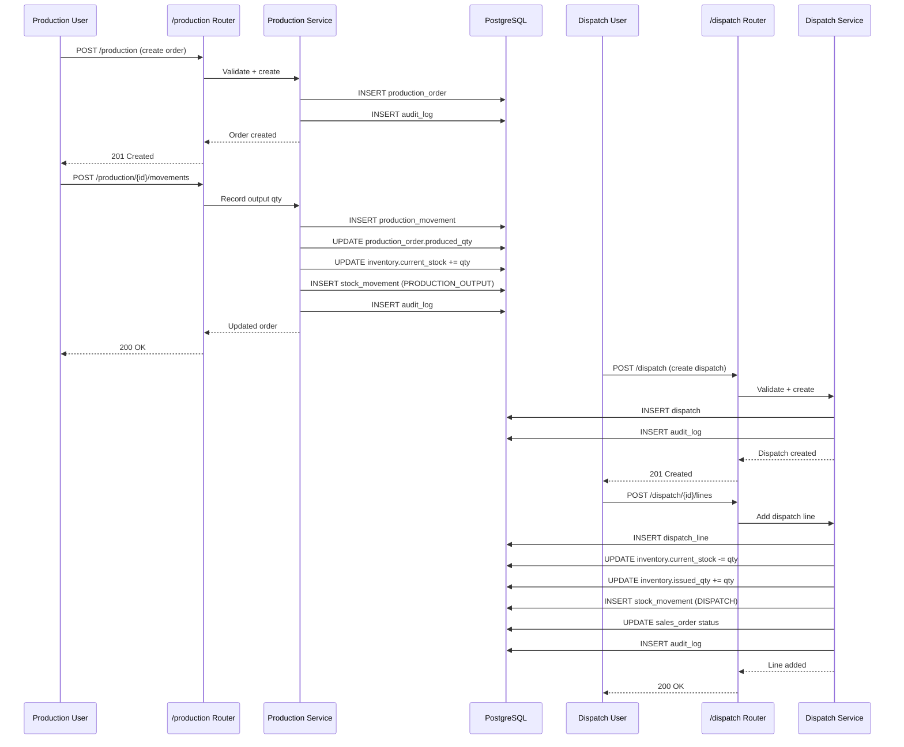

---

## 10. Alert & Requirement Engine

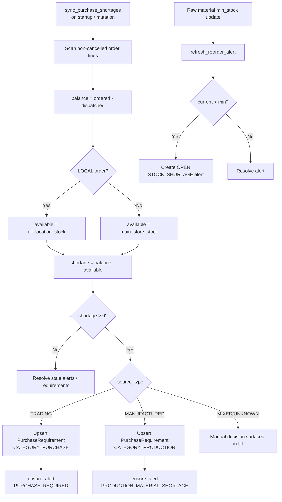

---

## 11. Stock Flow & Internal Transfers

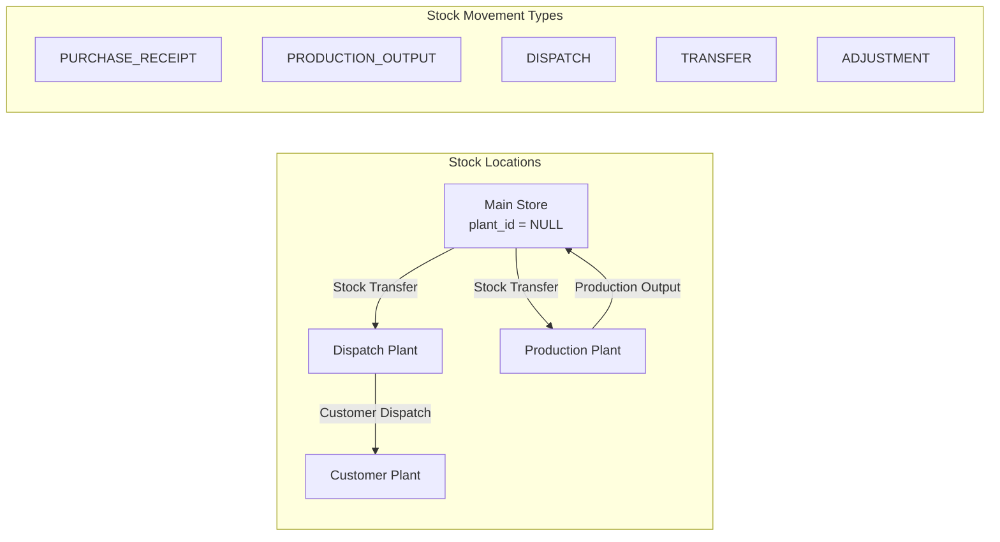

---

## 12. Dashboard & Reports Flow

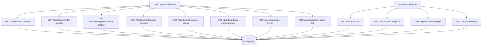

---

## 13. Frontend Routing Flow

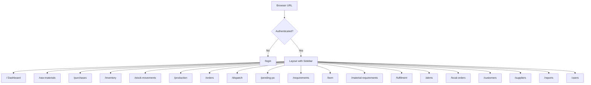

---

## 14. Deployment & CI/CD Flow

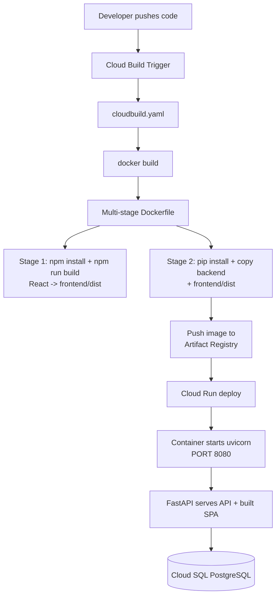

### Local Development Flow

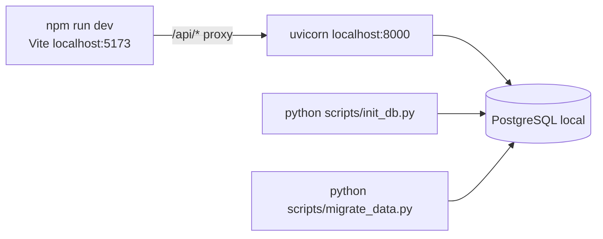

---

## 15. Startup Sequence

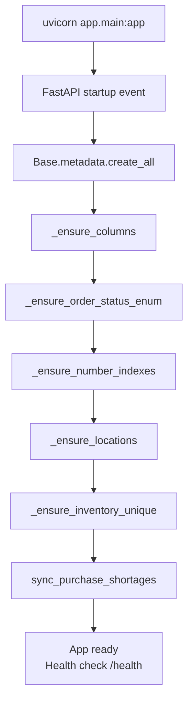

---

## 16. Module → Router Mapping

| Module | Router File | Prefix |
|--------|-------------|--------|
| Auth | `app/routers/auth.py` | `/auth` |
| Users | `app/routers/users.py` | `/users` |
| Customers | `app/routers/customers.py` | `/customers` |
| Suppliers | `app/routers/suppliers.py` | `/suppliers` |
| Products | `app/routers/products.py` | `/products` |
| Plants | `app/routers/plants.py` | `/plants` |
| Raw Materials | `app/routers/raw_materials.py` | `/raw-materials` |
| Purchases | `app/routers/purchases.py` | `/purchases` |
| Inventory | `app/routers/inventory.py` | `/inventory` |
| Stock Flow | `app/routers/stock_flow.py` | `/stock-locations`, `/stock-transfers`, `/customer-dispatches` |
| Production | `app/routers/production.py` | `/production` |
| Orders | `app/routers/orders.py` | `/orders` |
| Dispatch | `app/routers/dispatch.py` | `/dispatch` |
| Plans | `app/routers/plans.py` | `/plans` |
| Requirements | `app/routers/requirements.py` | `/requirements` |
| Material Requirements | `app/routers/material_requirements.py` | `/material-requirements` |
| Fulfilment | `app/routers/fulfilment.py` | `/fulfilment` |
| Local Orders | `app/routers/local_orders.py` | `/local-orders` |
| BOM | `app/routers/bom.py` | `/bom` |
| Alerts | `app/routers/alerts.py` | `/alerts` |
| Dashboard | `app/routers/dashboard.py` | `/dashboard` |
| Reports | `app/routers/reports.py` | `/reports` |
| Meta | `app/routers/meta.py` | `/meta` |
| Salespersons | `app/routers/salespersons.py` | `/salespersons` |

---

## 17. Key Business Rules

1. **Inventory is dual-tracked**: `current_stock = opening_stock + received_qty - issued_qty`.
2. **Every stock-changing operation** creates a `stock_movement` row.
3. **Sales order status** is auto-recomputed from real signals and only advances forward.
4. **Purchase requirements** are generated from genuine shortages; LOCAL orders use all-location stock.
5. **Raw material alerts** fire when `current_stock < min_stock`.
6. **SO/PO numbers** are business references, not unique keys; internal `id` is the system key.
7. **Audit logs** are written on every mutating API call.
8. **v2 migration** never touches the live DB; it validates in SQLite staging first.

---

*Generated for Kalika Enterprises ERP.*
